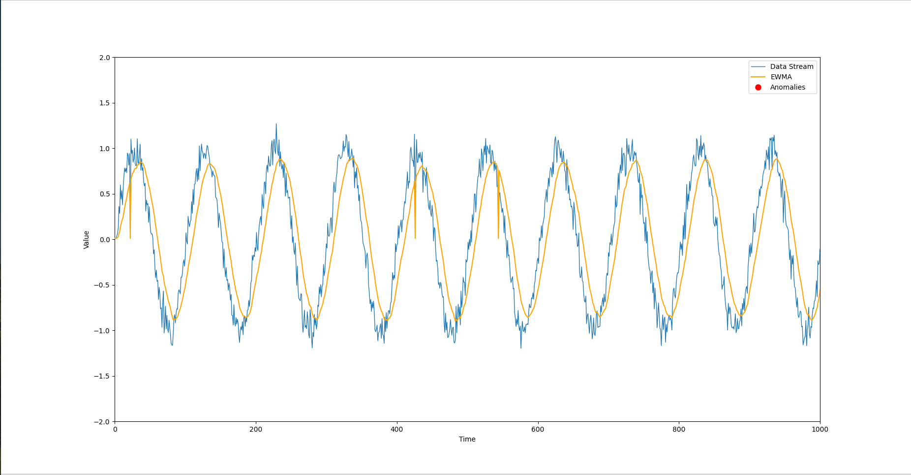

# Real-Time Anomaly Detection in Data Streams Using EWMA

This project showcases a real-time data stream simulator and anomaly detection system based on Exponentially Weighted Moving Average (EWMA). The anomalies are detected in real-time and visualized dynamically using `matplotlib`. The stream represents time-series data with seasonal patterns and noise, emulating scenarios like financial metrics or system monitoring.

## Table of Contents

- [Overview](#overview)
- [Key Features](#key-features)
- [Project Structure](#directory-structure)
- [Installation Guide](#installation)
- [How to Use](#usage)
- [Anomaly Detection Algorithm](#algorithm-explanation)
- [Error Handling](#error-handling)
- [License](#license)

## Overview

This project is a simulation-based application that:
1. **Simulates a data stream** with a seasonal pattern (sine wave) and random noise.
2. **Applies EWMA** (Exponentially Weighted Moving Average) to the data stream for anomaly detection.
3. **Visualizes the data**, EWMA line, and anomalies in real time.

The EWMA method is particularly suitable for tracking subtle changes in time-series data, making it ideal for real-time anomaly detection tasks.

## Screenshot of Result


## Features

- Continuous simulation of time-series data with noise.
- Real-time anomaly detection based on EWMA.
- Real-time graphical visualization of the data stream, EWMA curve, and anomalies.
- Modular and extensible codebase for easy modification.
  
## Directory Structure

```
Efficient-Data-Stream-Anomaly-Detection/
│
├── main.py                 # Entry point of the application
├── requirements.txt        # List of dependencies
├── README.md               # Project description and instructions
│
├── detector/
│   └── ewma_detector.py    # EWMAAnomalyDetector class
│
├── simulator/
│   └── data_stream.py      # DataStreamSimulator class
│
└── plotter/
    └── real_time_plotter.py # RealTimePlotter class
```

## Installation

1. **Clone the repository**:

   ```bash
   git clone https://github.com/rkaran2558/Efficient-Data-Stream-Anomaly-Detection.git
   cd Efficient-Data-Stream-Anomaly-Detection
   ```
2. **Install required system dependencies only for Linux Systems**:

   This project requires `python3-tk` for the visualization. Install it using:

   ```bash
   sudo apt-get install python3-tk
   ```
3. **Install required Python dependencies**:

   Make sure you have Python 3.x installed. Then install the dependencies listed in `requirements.txt`:

   ```bash
   pip install -r requirements.txt
   ```

   Example of `requirements.txt`:

   ```
   matplotlib==3.4.3
   numpy==1.21.2
   ```


3. **Run the project**:

   Execute the main Python script to start the simulation and real-time visualization:

   ```bash
   python main.py
   ```

## Usage

- The application will simulate a real-time data stream and plot the data points in real-time.
- The EWMA algorithm is applied to detect anomalies in the data stream.
- The plot will show:
  - **Data Stream**: The noisy sine wave.
  - **EWMA**: A smoothed version of the data stream.
  - **Anomalies**: Points where the deviation from the EWMA exceeds the specified threshold.
  
## Algorithm Explanation

### Exponentially Weighted Moving Average (EWMA)
EWMA is a technique that applies exponentially decreasing weights to past observations, making it useful for detecting anomalies in time-series data. The formula is:

\
	EWMA_t = α×X_t + (1−α)×EWMA_t−1

Where:
- \(X_t) is the current data point.
- \(α) is the smoothing factor (0 < (α) ≤ 1).
  
The anomaly detection is based on comparing the current data point with the calculated EWMA. If the difference (anomaly score) between them exceeds a pre-defined threshold, the point is flagged as an anomaly.

### Why EWMA?
EWMA is excellent for detecting sudden changes or gradual shifts in data patterns. Its ability to emphasize recent data while still considering older values makes it effective for real-time anomaly detection without overreacting to noise.

### Visualization
The system uses `matplotlib` to provide real-time plots of the data stream, the EWMA, and any anomalies. This allows for a clear, visual understanding of when and where anomalies occur.

## Error Handling

- **Data Stream**: The code ensures a continuous flow of data even with artificial delays between points to simulate real-time data acquisition.
- **Anomalies**: The anomaly detection system gracefully handles edge cases, such as initialization with the first data point.
- **Interruptions**: The code catches `KeyboardInterrupt` to allow for graceful termination of the program.# realtime_analogy_detection_cobblestone
